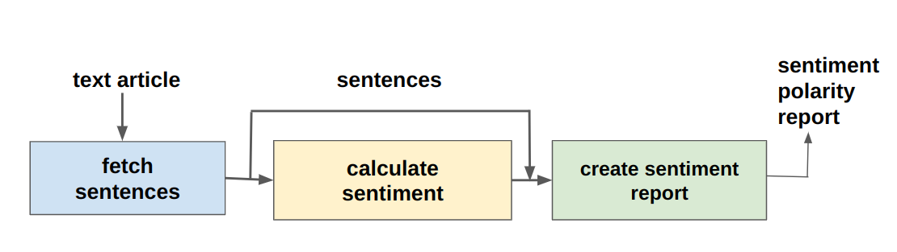
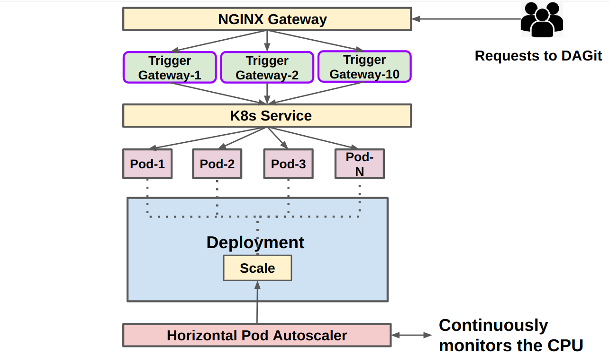

# DAGit - A Platform for Enabling Serverless Applications

DAGit is a platform designed to streamline the development and deployment of serverless applications using Directed Acyclic Graphs (DAGs). With DAGit, you can efficiently manage trigger events, register DAGs, and deploy functions seamlessly currently being maintained by Anubhav Jana and Purushottam Kulkarni from Indian Institute of Technology Bombay.


## Citation

Anubhav Jana, Purushottam Kulkarni, and Umesh Bellur. "DAGit: A Platform For Enabling Serverless Applications." In *Proceedings of the 2023 IEEE 30th International Conference on High Performance Computing, Data, and Analytics (HiPC)*, pp. 367-376. DOI: [10.1109/HiPC58850.2023.00054](https://doi.org/10.1109/HiPC58850.2023.00054).

## Link to the Publication

[30th IEEE International Conference On High Performance Computing, Data, & Analytics (HiPC 2023)](https://ieeexplore.ieee.org/document/10487054)

<!-- <kbd style="border: 1px solid black; padding: 8px;">
<a href="https://ieeexplore.ieee.org/document/10487054">Published at the 30th IEEE International Conference On High Performance Computing, Data, & Analytics (HiPC 2023)</a>
</kbd> -->

### Trigger Specification

Trigger specification is a json file which follows a specific JSON Schema in accordance with DAGit. Following are the fields in the specification.

>* "trigger_name" : Name of the trigger. This is used while executing the workflow with the trigger.
>* "type": Type specifies whether the trigger is for function or dag. Accepted values are "dag" and "function"  
>* "priority": priority level of the trigger which also determines the priority level of the workflow (e.g. gold > silver > bronze)
>* "dags": If "type" field is specified as "dag", this field will accept a list of dag names to trigger (type = list). Else keep it as ""  
>* "functions": If "type" field is specified as "function",this field will accept a list of functions to trigger (type = list). Else keep it as ""

Below is a sample example of a trigger specification 

```python
{
    "trigger_name": "text_sentiment_analysis_trigger",
    "type":"dag",
    "priority":"gold",
    "dags": ["text-sentiment-analysis"],
    "functions":""
}
```


### Trigger Registration

Trigger registration is an important aspect of executing workflows which runs in response to triggers. 
Triggers can be registered by executing the following python script which accepts a trigger json specification as an input.

```python
import requests
import sys
import json

# Usage: python3 <thisfile.py> <trigger.json>
def server():
    url = "http://10.129.28.219:5001/register/trigger/"
    input_json_file = open(sys.argv[1])
    params = json.load(input_json_file)
    reply = requests.post(url = url,json = params,verify=False)
    print(reply.json())
   

def main():
    server()

if __name__=="__main__":
    main()

```

### DAG Primitives

> DAG (Directed Acyclic Graphs) is a set of nodes connected by edges where each edge repsents control flow path and the nodes represent functions in the workflow. Below are the DAG primitives supported by DAGit. 


### DAG Specification

DAG specification is a json file which follows a specific JSON Schema in accordance with DAGit. Following are the fields in the specification.

>* "name" : Name of the DAG  
>* "node_id": Name of the function  
>* "label": Name you want to give to the node  
>* "primitive": Type of primitive the action supports - condition,parallel,serial(sequential)  
>* "condition": If primitive type is "condition", then you should provide the following fields "source", "operator" and "target", else you should leave it as ""  
>* "source": Specify any one of the response keys of the current node_id. For e.g. if one of the keys in response json is "result", and you want to provide a condition that if result=="even", then specify "source" as "result" and "target" as "even"  
>* "operator": Mathematical operations like "equals", "greater_than" , "less_than", "greater_than_equals", "less_than_equals" are accepted.  
>* "target": Specify the target value. It can accept both integer and string.  
>* "next": Specify the name of next node_id to be executed. If primitive = "parallel", "next" will take list of node_ids, else it will accept a single node_id in "<node id>" format. If this is the last node_id(ending node of the workflow), keep it as "".  
>* "branch_1": Specify node_id if primitive == condition else keep "". This is the target branch which will execute if condition is true  
>* "branch_2": Specify node_id if primitive == condition else keep "". This is the alternate branch which will execute if condition is false  
>* "arguments": Keep it blank for each node_id. It will get populated with json when the DAG is instantiated with the trigger.  
>* "outputs_from": Specify the list of node_id/node_ids whose output current node_id needs to consume. This is for data dependancy.

Below is a sample example of a DAGit specification format:

```python
{
    "name": "text-sentiment-analysis",
    "dag": [
        {
            "node_id": "fetch_sentences",
            "properties":
            {
                "label": "Fetch Sentences",
                "primitive": "serial",
                "condition":{},
                "next": "calculate_sentiment",
                "branch_1": "",
                "branch_2": "",
                "arguments": {},
                "outputs_from":[]
            }
        },
        {
            "node_id": "calculate_sentiment",
            "properties":
            {
                "label": "Calculate Sentiment Polarity",
                "primitive": "serial",
                "condition":{},
                "next": "create_sentiment_report",
                "branch_1": "",
                "branch_2": "",
                "arguments": {},
                "outputs_from": ["fetch_sentences"]
            }
        },
        {
            "node_id": "create_sentiment_report",
            "properties":
            {
                "label": "Create a sentiment report for sentences",
                "primitive": "serial",
                "condition":{},
                "next": "",
                "branch_1": "",
                "branch_2": "",
                "arguments": {},
                "outputs_from": ["fetch_sentences","calculate_sentiment"]
            }
        }

    ]
   
}
```

Below diagram depicts the DAG specified above.




Below is another example for DAG specification which includes conditional primitive as well as loop back to the previous function.

```python
{
    "name": "filling-a-glass-of-water",
    "dag": [
        {
            "node_id": "check_if_full",
            "properties":
            {
                "label": "Check if full",
                "primitive": "condition",
                "condition":
                {
                    "source":"quantity",
                    "operator":"less_than",
                    "target": "1000"

                },
                "next": "",
                "branch_1": "add_water",
                "branch_2": "glass_full",
                "arguments": {},
                "outputs_from":["add_water"]

            }
        },
        {
            "node_id": "add_water",
            "properties":
            {

                "label": "Add Water",
                "primitive": "serial",
                "condition": {},                
                "next": "check_if_full",
                "branch_1": "",
                "branch_2": "",
                "arguments":{},
                "outputs_from":["check_if_full"]

            }
            
        },
        {
            "node_id": "glass_full",
            "properties":
            {

                "label": "GLASS FULL",
                "primitive": "serial",
                "condition": {},
                "next": "",
                "branch_1": "",
                "branch_2": "",
                "arguments":{},
                "outputs_from":["check_if_full"]                

            }
            
        }
        
        
    ]
   
}
```

Below diagram depicts the DAG specified above.


## Function Registration 

> DAGit has an implemented Class named Functions which has the following utility functions:  
> * register_function (path_to_script, function_name, dockerfile, type) : Register a function of type (cpu or gpu) onto DAGit function store
> * list_functions() : List all the functions  
> * get_function(function) : Fetches information for a given function name  
> * delete_function(function) : Deletes a given function from DAGit function store.  

> Previously we used Openwhisk as the serverless backend for registering and executing serverless functions. Currenly we haved moved on to our own platform for function registration and giving the necessary background components to run serverless workflow.  
> Kubernetes components that DAGit uses for establishing a backend for executing functions :  
> * Deployments  
> * NodePort Service  
> * Horizontal Pod Autoscalar (HPA)  

The following figure demonstrates the architecture components




> DAGit has an implemented Class named Deployment Manager which has the following utility functions:  
> * create_deployment() : Creates a deployment object 
> * update_deployment_cpu_resources(deployment_name, cpu_request, cpu_limit) : Updates the pods with a given deployment with updated CPU limits ans requests.
> * delete_deployment(deployment_name) : Deletes a given deployment  
> * set_autoscaling(min_replicas, max_replicas) : Creates a HPA with minimum and maximum replicas.  
> * update_hpa(hpa_name,new_min_replica,new_max_replica): Updates a given HPA with new min and max replica pod count
> * create_service() : Creates a service object of type NodePort.  
> * delete_service(service_name) : Deletes the given service  
> * delete_hpa(hpa_name) : Deletes a given HPA.

Below is a sample code snippet to demonstrate the usage of the Functions and Deployment Manager Class to register the function. Note that the "min_Replicas" and "max_replicas" is configurable by the user

```python


from functions import Functions
from deployment import DeploymentManager


fr = Functions() 
func = fr.register_function("./function_modules/fill_glass_water/glass_full/glass_full.py","glass_full","10.129.28.219:5000/glass_full","cpu")
deployment = DeploymentManager(func)
deployment.create_deployment()
node_port = deployment.create_service()
deployment.set_autoscaling(min_replicas=1, max_replicas=70)

```

Below is another sample code snippet to demonstrate the usage of the Functions and Deployment Manager Class to de-register the function.

```python

from functions import Functions
from deployment import DeploymentManager

func = "glass_full"
fr = Functions()

deployment = DeploymentManager(func)
deployment_name = "dagit-deployment-"+deployment.function_name
service_name = deployment.function_name
hpa_name = deployment.function_name


# Delete deployment 
deployment.delete_deployment(deployment_name)
deployment.delete_service(service_name)
deployment.delete_hpa(hpa_name)

# Delete function from the store

fr.delete_function(func)


```


## DAGit Operations and Interactions


## How do functions read data 
The control plane passes intermediate data in the form of keys to the functions. The developer of the function has to read the key. Suppose you want to fetch the "url" from the parameters. Example of such an implementation is provided in the below script. 

```python

    ''' necessary imports '''

    import redis
    import pickle

    ''' import other libraries '''   
    

    ''' Rest of the code '''

    # If part of an intermediate function in the workflow         

    try:
        
        params = request.json
        host = params.get("host")
        port = params.get("port")
        key = params.get("key")
        redis_instance = redis.Redis(host=host, port=port,db=2)
        input = pickle.loads(redis_instance.get(key))        
        url = input["url"]

    # If its a starting function

    except:        
        url = params["url"]  

    # This url can now be used in the functon implementation anywhere

    ''' Rest of the code '''
    
    

```

## How do functions write data 

The functions running on container call a generic function **store_intermediate_data** (provided to the developer) to store the intermediate data and return the key as a pointer to the data. This is done to minimize data movement between control plane and the containers. 

* data : The response data to be stored by the function 

* function name : The name of the function for which to store the intermediate data

* destination : Destination storage as to where to store. Currently we support redis and S3 minio

Below is the code snippet of how to use this function call

```python

        import store_output
        ''' import other necessary libraries '''

        ''' Rest of the function implementation '''

        activation_id = str(uuid.uuid4()) 

        response = {
        "activation_id": activation_id,
        "quantity": quantity
        }

        key = store_output.store_intermediate_data(response,'fetch_sentences','redis')  
    
        response_data={}
        response_data["activation_id"] = activation_id    
        response_data["key"] = key
    
        return jsonify(response_data) # returns key and activation id 

```
Add this snippet at the end of your function before returning output.

Note that you need to include the file store_output.py from the controlplane/ directory to your function directory and build the docker image out of it.

Here is a sample Dockerfile to build the image

``` Dockerfile
FROM python:3.9-slim

# Set the working directory in the container
WORKDIR /usr/src/app

# Copy the current directory contents into the container at /usr/src/app
COPY . .

RUN pip install redis

RUN pip install flask

RUN pip install requests

# make sure to install python-dotenv and minio to use store_output

RUN pip install python-dotenv
RUN pip install minio

CMD ["python", "data_processing.py"]


```

## How to run DAGit

```bash

# Change directory to the path where source files are present 

$ cd <path to DAGit>

$ sudo ./minio server /minio # Start the minio client

$ cd <path_to_DAGit>/controlplane 

$ python3 trigger_gateway.py # Starts DAGit instance 

```

## Running a DAG using trigger

The given example shows a trigger named "text_sentiment_analysis_trigger" which is associated with a DAG which is again associated with functions.

> POST  http://10.129.28.219/run/text_sentiment_analysis_trigger 

## DAGit Logging

Each request processes by DAGit is logged in the format:

Request Start Timestamp || Request End Timestamp || Workflow Start Timestamp || Workflow End Timestamp || Total Response Time || Workflow Response Time || Priority || Trigger ID || DAG ID || DAG Activation ID

```log

2024-05-11 04:12:26.262, 2024-05-11 04:12:27.838, 2024-05-11 04:12:26.263,2024-05-11 04:12:27.833, 1.576, 1.57, gold, text_sentiment_analysis_trigger, text-sentiment-analysis, 065f0689-69e3-445c-a6eb-c1507dd4abde

```
