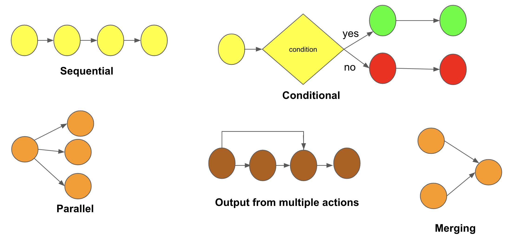
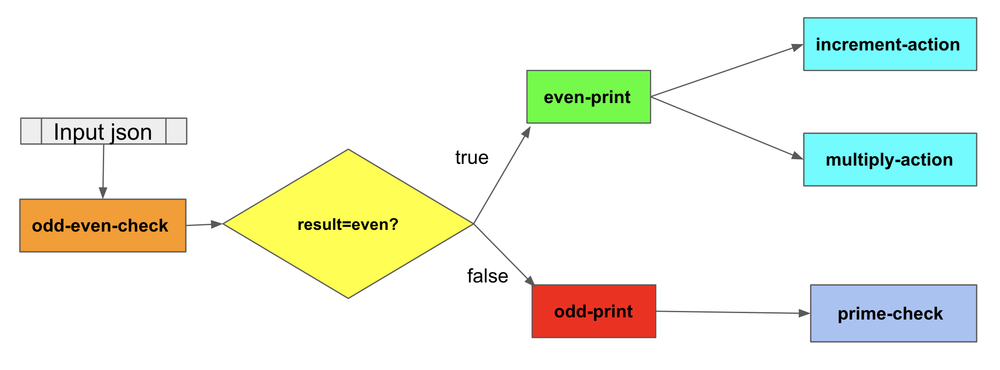

<h1> DAGit </h1>

<<<<<<< HEAD
<p><h3>Currently being developed by Anubhav Jana along with Prof Puru IITB</h3></p>
=======
<p><h3>Currently being maintained by Anubhav Jana, IITB</h3></p>
>>>>>>> 152069aa8f6e2089787526c9d8af5c3ec1ac02f5

<h4>This serverless FaaS platform supports individual function registrations, DAG registrations, Trigger registrations associated with DAGs/functons. This platform also supports various DAG primitives which is provided in this document for reference.</h4>

<h2> Guide: Register a Function </h2>
<h4> This section will guide you how to register a function. The following pre-requites are to be fulfilled before you register a function </h4>

* DockerFile - based on which the image will be build to run your function

* Python file - application logic to run the action/function (Here, in this example this is "test.py")

* requirements.txt - add all dependant pip packages in this file. In case you dont have any library dependancies,submit a blank requirements.txt

<h5> You must have the above 3 files before you register the function </h5>

<h4> Following is the sample code <u>register_function.py</u> to register a function. This will create a new function named "testaction" and register it onto our function store handled by us. The url endpoint is: /regster/function/function_name</h4>

<h4> register_function.py </h4> 

```python
import requests
import sys
import json


def server():
    
    url = "http://10.129.28.219:5001/register/function/testaction"
    files = [
    ('pythonfile', open(sys.argv[1],'rb')),
    ('dockerfile', open(sys.argv[2],'rb')),
    ('requirements.txt', open(sys.argv[3],'rb'))
   ]

   reply = requests.post(url = url,files = files,verify=False)
   print(reply.json())
   
def main():
    server()

if __name__=="__main__":
    main()
```

* <b>Usage:</b> python3 register_function.py test.py Dockerfile requirements.txt

<h2> Guide: Register a DAG </h2>
<h4> This section will guide you how to register a DAG. The following pre-requites are to be fulfilled before you register a DAG </h4>

* dag.json - a JSON specification file to define the DAG. Accepted DAG Format and a sample example is provided in this readme file itself.


<h4> Following is the sample code <u>dag_register.py</u> to register a DAG. This will register a new DAG onto our DAG store handled by us. The url endpoint is: /regster/dag</h4>

<h4> dag_register.py </h4> 

```python
import requests
import sys
import json

def server():
    url = "http://10.129.28.219:5001/register/dag"
    input_json_file = open(sys.argv[1])
    params = json.load(input_json_file)
    reply = requests.post(url = url,json = params,verify=False)
    print(reply.json())


def main():
    server()

if __name__=="__main__":
    main()
```

* <b>Usage:</b> python3 dag_register.py dag.json

<h2> Guide: Register a Trigger </h2>
<h4> This section will guide you how to register a trigger. The following pre-requites are to be fulfilled before you register a trigger </h4>

* trigger.json - a JSON specification file to define the trigger. Accepted DAG Format and a sample example is provided in this readme file itself.

<h4>Accepted Trigger Format</h4>

DAG specification includes both control dependancy as well as the control dependancy

<h4> Trigger Fields </h4>

* "trigger_name" : Name of the trigger. Type accepted is string

* "type": Type specifies whether the trigger is for function or dag. Accepted values are "dag" and "function"

* "trigger": Specifies the endpoint route

* "dags": If "type" field is specified as "dag","dags" will accept a list of dags to trigger (type = list). Else keep it as ""

* "functions": If "type" field is specified as "function","functions" will accept a list of functions to trigger (type = list). Else keep it as ""

<h3>Example format of trigger.json</h3>

```python
{
    "trigger_name": "mydagtrigger",
    "type":"dag",
    "dags": ["odd-even-test","dummy-dag"],
    "functions":""
}
```
```python
{
    "trigger_name": "myfunctiontrigger",
    "type":"function",
    "dags":"",
    "functions": ["odd-even-action"]
}

```

<h4> Following is the sample code <u>trigger_register.py</u> to register a trigger. This will register a new trigger onto our Trigger store handled by us. The url endpoint is: /regster/trigger</h4>

<h4> trigger_register.py </h4> 

```python
import requests
import sys
import json

def server():
    url = "http://10.129.28.219:5001/register/trigger/"
    input_json_file = open(sys.argv[1])
    params = json.load(input_json_file)
    reply = requests.post(url = url,json = params,verify=False)
    print(reply.json())
   

def main():
    server()

if __name__=="__main__":
    main()
```

* <b>Usage:</b> python3 trigger_register.py trigger.json


<h2> List of triggers </h2>

* http://10.129.28.219:5001/register/function/<function_name>

* http://10.129.28.219:5001/run/<trigger_name>


* http://10.129.28.219:5001/view/<dag_id>

* http://10.129.28.219:5001/view/activation/<function_activation_id>

* http://10.129.28.219:5001/view/dags

* http://10.129.28.219:5001/view/dag/<dag_name>

* http://10.129.28.219:5001/register/dag

* http://10.129.28.219:5001/view/functions

* http://10.129.28.219:5001/

<h3>Supported DAG Primitive</h3>

<!--  -->


<h2>Accepted DAG Format</h2>

DAG specification includes both control dependancy as well as the control dependancy

<h4> DAG Fields </h4>

* "name" : Name of the DAG

* "node_id": Name of the function/action

* "node_id_label": Name you want to give to the node 

* "primitive": Type of primitive the action supports - condition,parallel,serial(sequential)

* "condition": If primitive type is "condition", then you should provide the following fields "source", "operator" and "target", else you should leave it as ""

* "source": Specify any one of the response keys of the current node_id. For e.g. if one of the keys in response json is "result", and you want to provide a condition that if result=="even", then specify "source" as "result" and "target" as "even"

* "operator": Mathematical operations like "equals", "greater_than" , "less_than", "greater_than_equals", "less_than_equals" are accepted.

* "target": Specify the target value. It can accept both integer and string.

* "next": Specify the name of next node_id to be executed. If primitive = "parallel", "next" will take list of node_ids, else it will accept a single node_id in "<node id>" format. If this is the last node_id(ending node of the workflow), keep it as "". 

* "branch_1": Specify node_id if primitive == condition else keep "". This is the target branch which will execute if condition is true

* "branch_2": Specify node_id if primitive == condition else keep "". This is the alternate branch which will execute if condition is false

* "arguments": Keep it blank for each node_id. It will get populated with json when the DAG is instantiated with the trigger

* "outputs_from": Specify the list of node_id/node_ids whose output current node_id needs to consume. This is for data dependancy.


{

    "name":<string>

    "dag":[
        {
            "node_id": "<string>",
            "properties":
            {
                "node_id_label": "<string>"
                 
                "primitive":"<condition | parallel | serial>",
                "condition":
                {
                    "source":"<key obtained from node)id result json>",
                    "operator":"<equals || greater_than || less_than || ..>",
                    "target":"<string|integer>"

                },
                "next": "<next node_id to be executed : if primitive=parallel, "next" will take list of node_ids, if primitive: serial then specify a single node_id >",
                "branch_1": "<node_id if type==condition else keep "">",
                "branch_2": "<node_id if type==condition else keep "">",
                "arguments": {} ---> Keep it blank for all action. It will get updated when the DAG is run
                "outputs_from": "<list>"

            }
        },
        {
           
            
        },

        .
        .
        .

        {

        }
        
    ]
   
}

<h2>Sample Example Usage</h2>

<!--  -->



{
    
    "name": "odd-even-test",

    "dag": [

        {
            
            "node_id": "odd-even-action",
            "properties":
            {
                "label": "Odd Even Action",
                "primitive": "condition",
                "condition":
                {
                    "source":"result",
                    "operator":"equals",
                    "target":"even"
                },

                "next": "",
                "branch_1": "even-print-action",
                "branch_2": "odd-print-action",
                "arguments": {},
                "outputs_from":[]

            }
        },
        {
            "node_id": "even-print-action",
            "properties":
            {

                "label": "Even Print Action",
                "primitive": "parallel",
                "condition": {},
                "next": ["increment-action","multiply-action"],
                "branch_1": "",
                "branch_2": "",
                "arguments":{},
                "outputs_from":["odd-even-action"]

            }
            
        },
        {
            "node_id": "increment-action",
            "properties":
            {

                "label": "INCREMENT ACTION",
                "primitive": "serial",
                "condition": {},
                "next": "",
                "branch_1": "",
                "branch_2": "",
                "arguments":{},
                "outputs_from":["even-print-action"]
                

            }
            
        },
        {
            "node_id": "multiply-action",
            "properties":
            {

                "label": "MULTIPLY ACTION",
                "primitive": "serial",
                "condition": {},
                "next": "",
                "branch_1": "",
                "branch_2": "",
                "arguments":{},
                "outputs_from":["even-print-action"]

            }
            
        },
        {
            "node_id": "odd-print-action",
            "properties":
            {
                "label": "Odd Print Action",
                "primitive": "serial",
                "condition":{},
                "next": "prime-check-action",
                "branch_1": "",
                "branch_2": "",
                "arguments":{},
                "outputs_from":["odd-even-action"]
            }
            
        },
        {
            "node_id": "prime-check-action",
            "properties":
            {
                "label": "Prime Check Action",
                "primitive": "serial",
                "condition":{},
                "next": "",
                "branch_1": "",
                "branch_2": "",
                "arguments":{},
                "outputs_from":["odd-print-action"]


            }
            
        }
        
    ]
   
}


<h2>Handle output from multiple actions</h2>

<p><h4>Suppose you want to merge outputs from two actions action_1 and action_2 in your action_3, then you must include the following lines in your action_3 to process incoming inputs from action_1 and action_2</p></h4>. This is applicable for merging primitive as well as handling output from multiple actions.


* "key_action_1" refers to a key from action_1 response which you want to use in action_3
* "key_action_2" refers to a key from action_2 response which you want to use in action_3


params = json.loads(sys.argv[1])

op_1 = params["__ow_body"][0]["key_action_1"]

op_2 = params["__ow_body"][1]["key_action_2"]

Use these op_1 and op_2 to process


